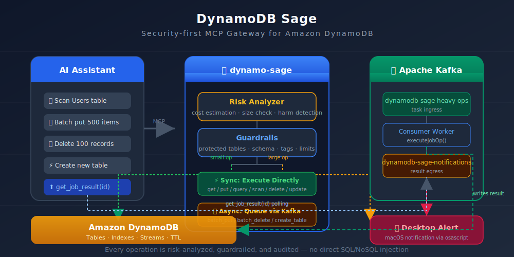

# 🧙 DynamoDB-Sage

**Natural Language Interface for Amazon DynamoDB**

A secure, production-grade **Model Context Protocol (MCP)** gateway that lets LLM agents safely query and mutate DynamoDB using plain English.

[](https://go.dev)
[](https://aws.amazon.com/dynamodb/)
[](https://kafka.apache.org/)
[](https://modelcontextprotocol.io)

[](https://www.youtube.com/watch?v=f4i8fxrdEBw)

---

### Why DynamoDB-Sage?

LLM agents are powerful but risky when given direct database access. They can trigger expensive scans, destructive mutations, or leak sensitive data.

**DynamoDB-Sage** acts as an intelligent, zero-trust security layer between LLMs and DynamoDB:

- **Risk Analysis** — Every operation is evaluated before execution. Cost estimation, blast-radius detection, and production-table protection run automatically.
- **Smart Execution** — Fast synchronous path for simple queries. Heavy operations (batch writes, full scans, table creation) are offloaded to Kafka workers.
- **Real-time Notifications** — Push alerts to the UI the moment a job completes or a risk is detected.
- **Full Audit Trail** — Immutable logs with execution context, cost tracking, and security metadata.

---

### Key Features

- **Natural Language Queries** — Talk to your DynamoDB in plain English
- **Risk Analyzer + Guardrails** — Custom two-layer protection against destructive and expensive operations
- **Dual Execution Engine** — Synchronous for speed, asynchronous via Kafka for heavy operations
- **Streaming Chat** — Real-time token-by-token responses from Claude
- **Real-time Observability** — Prometheus metrics, SSE notifications, and a built-in dashboard
- **MCP Compatible** — Works with Claude Desktop, Cursor, opencode, and any MCP client
- **One-Command Deploy** — Single binary, single server, Docker Compose on AWS Lightsail

---

### Tech Stack

| Layer | Technology |
|-------|------------|
| Language | Go 1.25+ |
| Database | Amazon DynamoDB |
| Messaging | Apache Kafka + Zookeeper |
| LLM | Anthropic Claude (streaming) |
| Protocol | Model Context Protocol (MCP) |
| Observability | Prometheus metrics |
| Frontend | Next.js 16 + React + TypeScript, Tailwind CSS, shadcn/ui |
| Infrastructure | Docker Compose, Terraform, AWS Lightsail |
| HTTPS | Let's Encrypt + nginx |

---

### Quick Start

```bash
# Clone and run with Docker
git clone https://github.com/taofit/MCP-Server-Dynamodb-sage.git
cd dynamodb-sage
cp .env.example .env    # edit with your AWS keys
docker compose --profile local up -d --build
```

Then connect with any MCP client:

```bash
npx @modelcontextprotocol/inspector --transport http http://localhost:8080
```

---

<details>
<summary><strong>Local Development (Full Setup)</strong></summary>

#### Services

| Service      | Profile   | Default |
|--------------|-----------|---------|
| App (Go)     | —         | yes     |
| Zookeeper    | —         | yes     |
| Kafka        | —         | yes     |
| LocalStack   | `local`   | no      |

#### Steps

1. **Configure environment:**

```bash
cp .env.example .env
# Edit .env and set your variables:
# LOCALSTACK_AUTH_TOKEN=your_token_here
```

2. **Start the stack:**

```bash
docker compose --profile local up -d --build
```

3. **Verify services:**

```bash
curl http://localhost:4566/_localstack/health   # LocalStack
nc -z localhost 9092 && echo "Kafka up"         # Kafka
curl http://localhost:8080/health               # Go app
```

4. **Stop everything:**

```bash
docker compose --profile local down -v
```

#### Run Go binary locally (faster iteration)

Keep Kafka and LocalStack in Docker, run the Go binary directly:

```bash
KAFKA_BROKERS=localhost:9093 \
AWS_BASE_ENDPOINT=http://localhost:4566 \
AWS_REGION=eu-north-1 \
AWS_ACCESS_KEY_ID=your_key_id \
AWS_SECRET_ACCESS_KEY=your_secret_key \
MCP_TRANSPORT_MODE=http \
DYNAMO_SAGE_ADDR=:8081 \
go run .
```

> Kafka on `localhost:9093` (PLAINTEXT_HOST) and LocalStack on `localhost:4566` are the Docker host-mapped ports.

#### Test with MCP Inspector

```bash
# Docker compose
npx @modelcontextprotocol/inspector --transport http http://localhost:8080
# Local binary
npx @modelcontextprotocol/inspector --transport http http://localhost:8081
```

> **Troubleshooting:** If Kafka exits with `KeeperErrorCode = NodeExists`, run `docker compose --profile local down && docker compose --profile local up -d` for a clean restart.

</details>

---

<details>
<summary><strong>Chat Function</strong></summary>

The dashboard includes a built-in **AI chat assistant** powered by Claude. Describe what you want in natural language and it calls DynamoDB tools on your behalf.

**How it works:**

1. User sends a message via the chat UI
2. Message is streamed to Claude via `POST /api/chat` (SSE)
3. Claude calls tools (`list_tables`, `query_table`, etc.) and reasons over results
4. Responses stream back token-by-token to the UI

**Example prompts:**

- *"List all my DynamoDB tables"*
- *"Show me the schema of the users table"*
- *"Query the orders table where userId = 123"*
- *"How many items are in each table?"*

**Environment variables:**

| Variable | Required | Default | Description |
|----------|----------|---------|-------------|
| `LLM_API_KEY` | No | — | Anthropic API key (`sk-ant-...`). Falls back to SSM via `LLM_API_KEY_PARAM` |
| `LLM_API_KEY_PARAM` | No | `/dynamodb-sage/claude/api-key` | SSM parameter path for API key |
| `LLM_MODEL` | No | `claude-sonnet-5` | Model to use |
| `LLM_BASE_URL` | No | `https://api.anthropic.com` | API base URL (for proxies) |
| `LLM_TIMEOUT_SEC` | No | `30` | Request timeout in seconds |

> At least one of `LLM_API_KEY` or a valid SSM parameter must be available for chat to work.

</details>

---

### Architecture

```
MCP Client (Claude / Cursor / opencode)
        │
        ▼
┌──────────────────────────────────────────┐
│           DynamoDB-Sage Server           │
│                                          │
│  ┌──────────┐    ┌──────────────────┐    │
│  │ MCP API  │───▶│  Risk Analyzer   │    │
│  │ POST /   │    │  + Guardrails    │    │
│  └──────────┘    └────────┬─────────┘    │
│                           │              │
│              ┌────────────┴───────────┐  │
│              │                        │  │
│              ▼                        ▼  │
│    ┌──────────────┐    ┌────────────────┐│
│    │  Sync Path   │    │  Async Path    ││
│    │  DynamoDB    │    │  Kafka Worker  ││
│    └──────────────┘    └────────┬───────┘│
│                                 │        │
│                                 ▼        │
│                      ┌──────────────┐    │
│                      │ Notifications│    │
│                      │ SSE → UI     │    │
│                      └──────────────┘    │
│                                          │
│  ┌──────────┐  ┌──────────┐  ┌────────┐ │
│  │ Audit Log│  │ Metrics  │  │ Chat   │ │
│  │ SQLite   │  │Prometheus│  │ Claude │ │
│  └──────────┘  └──────────┘  └────────┘ │
└──────────────────────────────────────────┘
        │
        ▼
   AWS DynamoDB
```

<details>
<summary>Full architecture flow diagram</summary>


*Full description in [project-flow.md](project-flow.md)*

</details>

---

### Deployment

#### Option A: AWS Lightsail (Recommended)

A single Lightsail instance runs the full stack. nginx + Let's Encrypt provide HTTPS.

**First-time setup:**

```bash
cd terraform/lightsail
terraform init && terraform apply
```

This creates: Lightsail instance, static IP, SSH key, IAM user, SSM parameter for the API key, and firewall rules.

**Deploy:**

```bash
./scripts/deploy.sh dynamodb-sage.yourdomain.com
```

The script builds locally, uploads via SCP, and starts everything with Docker Compose.

**Set the LLM API key:**

```bash
aws ssm put-parameter \
  --name "/dynamodb-sage/claude/api-key" \
  --value "sk-ant-your-key" \
  --type "SecureString" \
  --overwrite
```

**Redeploy after code changes:**

```bash
./scripts/deploy.sh dynamodb-sage.yourdomain.com
```

**Verify:**

```bash
curl https://dynamodb-sage.yourdomain.com/health
# → ok
```

<details>
<summary>Detailed deployment notes</summary>

#### Instance name & Terraform state

The Lightsail instance uses the `instance_name` variable (default `Ubuntu-1`). Instance names are immutable — changing the variable forces a destroy/recreate. To adopt an existing instance with a different name:

```bash
cd terraform/lightsail
terraform state rm aws_lightsail_instance.app
terraform import aws_lightsail_instance.app Ubuntu-2
# Set instance_name = "Ubuntu-2" in terraform.tfvars
terraform plan   # should report "No changes"
```

> `scripts/deploy.sh` resolves the instance name from `terraform output -raw instance_name`. Override at runtime with `INSTANCE_NAME=... ./scripts/deploy.sh dynamodb-sage.yourdomain.com`.

#### Versioning

The binary embeds a version from `git describe --tags --always`. Tag before deploying:

```bash
git tag v1.0.0 && git push origin v1.0.0
```

No tags → falls back to commit hash → `"dev"`. Set `VERSION=...` to override.

#### Production architecture

| Component | Detail |
|-----------|--------|
| Region | `eu-north-1` |
| Compute | Lightsail (Ubuntu 22.04, 2 vCPU, 1 GiB RAM, 20 GB SSD) |
| App | Go binary in Docker (pre-built locally) |
| Queue | Apache Kafka + Zookeeper in Docker |
| LLM | Anthropic Claude via SSM parameter |
| Port | 8080 |
| Transport | Streamable HTTP (`POST /`) + SSE (`GET /sse`) |
| HTTPS | Let's Encrypt via certbot + nginx |
| IAM | `AmazonDynamoDBFullAccess` + `AmazonSSMReadOnlyAccess` |
| Logs | `sudo docker compose logs app` |

</details>

#### Option B: ECS + ALB + CloudFront (Reference)

The original high-availability deployment using ECS Fargate, ALB, CloudFront, and ECR. Infrastructure code preserved at `terraform/ecs-cloudfront/` for reference.

---

### Connecting MCP Clients

> **Public demo server** available at `https://dynamodb-sage.hzcentre.com` — try it directly with any MCP client by replacing the URL with yours in the JSON config below.

> ⚠️ **Important:** The risk analyzer returns warnings for expensive or destructive operations. Some MCP clients may auto-confirm these without asking. Tell the LLM explicitly: *"If the server returns a risk warning, show it to me and ask for my confirmation before proceeding."*

#### opencode

```json
{
  "mcpServers": {
    "dynamo-sage-local": {
      "type": "local",
      "command": ["go", "run", "."],
      "enabled": true
    },
    "dynamo-sage-aws": {
      "type": "remote",
      "url": "https://dynamodb-sage.yourdomain.com",
      "enabled": true
    }
  }
}
```

#### Claude Desktop

**Remote (Streamable HTTP):**

```json
{
  "mcpServers": {
    "dynamodb-sage": {
      "command": "npx",
      "args": ["-y", "supergateway", "--streamableHttp", "https://dynamodb-sage.yourdomain.com", "--streamableHttpPath", "/"]
    }
  }
}
```

**Local (stdio — requires Docker stack running):**

```json
{
  "mcpServers": {
    "dynamodb-sage-local": {
      "command": "sh",
      "args": ["-c", "cd /path/to/dynamodb-sage && KAFKA_BROKERS=localhost:9093 AWS_BASE_ENDPOINT=http://localhost:4566 AWS_REGION=eu-north-1 go run ."]
    }
  }
}
```

---

### Dashboard

Open `https://dynamodb-sage.yourdomain.com/` in a browser. A Next.js SPA embedded directly in the Go binary — no separate deployment.

| Tab | Description |
|-----|-------------|
| Chat | LLM-powered natural language interface with streaming responses, markdown tables, JSON rendering |
| Overview | Landing page with stats, quick actions, and system health |
| Activity | Grouped audit feed — operations organized by table with filters |
| Monitoring | Prometheus metrics dashboard with Recharts visualizations |
| Tools | Interactive DynamoDB tool playground (hidden by default, accessible via `?tools=true`) |

---

### Development

This project follows **GitHub Flow:**

1. Create a feature branch: `git checkout -b feature/your-feature`
2. Commit changes: `git commit -m "Add [feature]"`
3. Push: `git push origin feature/your-feature`
4. Open a PR on GitHub
5. Merge and sync local main

#### Related Documents

- [Development plan](development-plan.md) — full roadmap including planned features
- [Project flow](project-flow.md) — detailed architecture walkthrough
- [Kafka flow](assets/kafka-flow.svg) — async job processing diagram
- [Architecture flow](assets/architecture-flow.svg) — full system architecture
- [RAG development plan](rag-development-plan.md) — planned RAG extension

---

Made with ❤️ in Malmö
