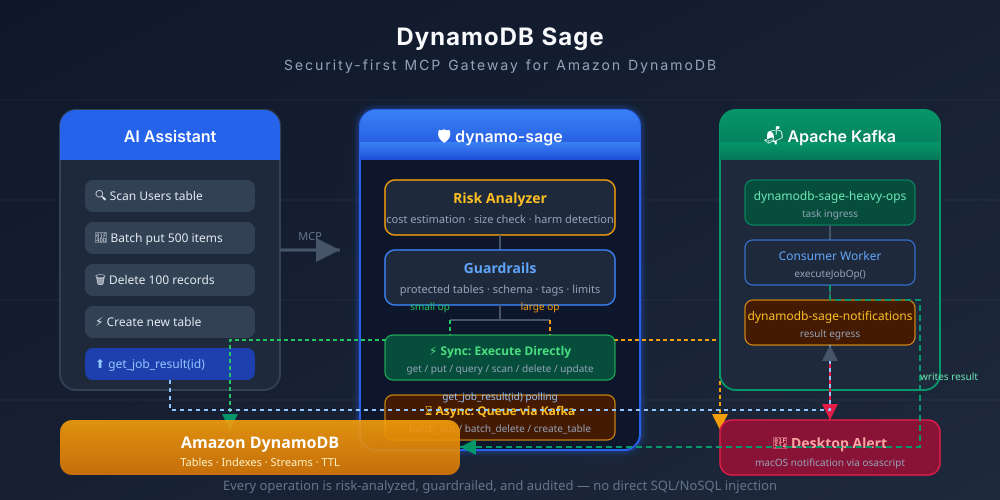

# 🧙 DynamoDB-Sage

**Natural Language Interface for Amazon DynamoDB**

A secure, production-grade **Model Context Protocol (MCP)** gateway that lets LLM agents safely query and mutate DynamoDB using plain English.

[](https://go.dev)
[](https://aws.amazon.com/dynamodb/)
[](https://kafka.apache.org/)
[](https://modelcontextprotocol.io)

[](https://www.youtube.com/watch?v=Xr4m7xRO51k)

---

## ▶️ Try It Live

**No signup required** — one click, read-only access:

- **Web dashboard:** [https://dynamodb-sage.hzcentre.com/login](https://dynamodb-sage.hzcentre.com/login) → click **"Try the live demo"**
- **MCP client:** connect to `https://dynamodb-sage.hzcentre.com` with `Authorization: Bearer guest-visitor`

> Guests get read-only tools (query, get, scan, list, describe, search). Admins get full access including writes. See [docs/mcp-clients.md](docs/mcp-clients.md) for client configs.

---

## Why DynamoDB-Sage?

LLM agents are powerful but risky when given direct database access. They can trigger expensive scans, destructive mutations, or leak sensitive data.

**DynamoDB-Sage** acts as an intelligent, zero-trust security layer between LLMs and DynamoDB:

- **Risk Analysis** — Every operation is evaluated before execution. Cost estimation, blast-radius detection, and production-table protection run automatically.
- **Smart Execution** — Fast synchronous path for simple queries. Heavy operations (batch writes, full scans, table creation) are offloaded to Kafka workers.
- **Real-time Notifications** — Push alerts to the UI the moment a job completes or a risk is detected.
- **Full Audit Trail** — Immutable logs with execution context, cost tracking, and security metadata.

---

## Key Features

- **Natural Language Queries** — Talk to your DynamoDB in plain English
- **Risk Analyzer + Guardrails** — Custom two-layer protection against destructive and expensive operations
- **Dual Execution Engine** — Synchronous for speed, asynchronous via Kafka for heavy operations
- **Streaming Chat** — Real-time token-by-token responses from Claude
- **Semantic Search (RAG)** — Turn DynamoDB tables into a searchable vector knowledge base via Qdrant
- **Real-time Observability** — Prometheus metrics, SSE notifications, and a built-in dashboard
- **MCP Compatible** — Works with Claude Desktop, Cursor, opencode, and any MCP client
- **One-Command Deploy** — Single binary, single server, Docker Compose on AWS Lightsail

---

## Tech Stack

| Layer | Technology |
|-------|------------|
| Language | Go 1.25+ |
| Database | Amazon DynamoDB |
| Messaging | Apache Kafka + Zookeeper |
| LLM | Anthropic Claude (streaming) |
| Vector Search | Qdrant + OpenAI embeddings |
| Protocol | Model Context Protocol (MCP) |
| Observability | Prometheus metrics |
| Frontend | Next.js 16 + React + TypeScript, Tailwind CSS, shadcn/ui |
| Infrastructure | Docker Compose, Terraform, AWS Lightsail |

---

## Architecture

```
MCP Client (Claude / Cursor / opencode)
        │
        ▼
┌──────────────────────────────────────────┐
│           DynamoDB-Sage Server           │
│                                          │
│  ┌──────────┐    ┌──────────────────┐    │
│  │ MCP API  │───▶│  Risk Analyzer   │    │
│  │ POST /   │    │  + Guardrails    │    │
│  └──────────┘    └────────┬─────────┘    │
│                           │              │
│              ┌────────────┴───────────┐  │
│              │                        │  │
│              ▼                        ▼  │
│    ┌──────────────┐    ┌────────────────┐│
│    │  Sync Path   │    │  Async Path    ││
│    │  DynamoDB    │    │  Kafka Worker  ││
│    └──────────────┘    └────────┬───────┘│
│                                 │        │
│                                 ▼        │
│                      ┌──────────────┐    │
│                      │ Notifications│    │
│                      │ SSE → UI     │    │
│                      └──────────────┘    │
│                                          │
│  ┌──────────┐  ┌──────────┐  ┌────────┐ │
│  │ Audit Log│  │ Metrics  │  │ Chat   │ │
│  │ SQLite   │  │Prometheus│  │ Claude │ │
│  └──────────┘  └──────────┘  └────────┘ │
└──────────────────────────────────────────┘
        │
        ▼
   AWS DynamoDB
```

*Full architecture + RAG deep-dive: [docs/architecture.md](docs/architecture.md)*

---

## Documentation

| Doc | Contents |
|-----|----------|
| [docs/development.md](docs/development.md) | Quick start, local setup, chat function, workflow |
| [docs/deployment.md](docs/deployment.md) | AWS Lightsail / ECS deployment, env vars |
| [docs/mcp-clients.md](docs/mcp-clients.md) | Claude Desktop / opencode / Cursor configs, dashboard |
| [docs/architecture.md](docs/architecture.md) | System architecture, RAG pipeline |

---

Made with ❤️ in Malmö