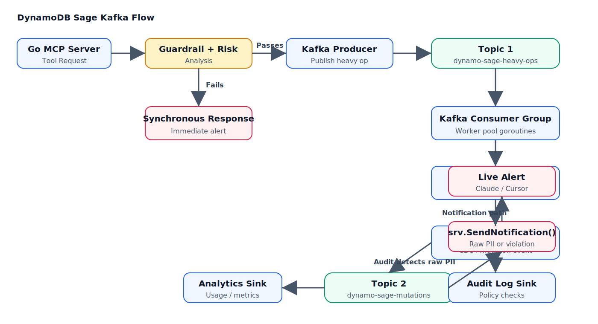

# DynamoDB-Sage Development Plan

## Architecture

```
MCP Client (Claude/Cursor/etc)
        ↓
  dynamo-sage (MCP Server)
        ↓
  [Risk Analyzer] ← cost estimator + harm detector
        ↓ (if safe or user confirms)
  AWS DynamoDB
```

## Key components**

1. MCP Server layer — expose DynamoDB operations as MCP tools (query, put, delete, scan, etc.)

2. Risk Analyzer — intercept every operation and evaluate:
   - Table size check before scan (describe-table → item count × avg item size)
   - Production table detection (by name pattern like `prod-*`, tags, or config)
   - Bulk delete/update detection (BatchWriteItem with large payloads)
   - Expensive filter expressions on large tables

3. Cost Estimator — rough WCU/RCU calculation before execution:
   - Scan: full table read = table size / 4KB RCUs
   - Query: estimated based on index + filter selectivity
   - Write ops: item size / 1KB WCUs

4. Guardrails — define rules to prevent dangerous operations:
   - `config/environments.go` — dev/staging/prod environment detection
   - `config/policies.go` — fine-grained permission policies per table
   - `config/budgets.go` — daily/monthly cost budgets with alerts
   - `config/approval_flows.go` — multi-step approval for high-risk operations

5. Confirmation flow — return a warning tool response asking user to confirm before proceeding with risky ops

6. Audit Log — SQLite-backed audit log exposed as an MCP tool (done):
   - `internal/audit/` — logger, entry model, SQLite queries
   - MCP tool `read_audit_logs` with time range + limit filters

7. Kafka event pipeline and async notifications — durable heavy ops, job result polling, and desktop alerts:

   **Kafka flow**

   

   **Readable flow**

   1. A client sends a tool request to the Go MCP server.
   2. The server runs synchronous guardrail and risk checks.
   3. If the request fails, the server returns an immediate synchronous error.
   4. If the request passes, the server evaluates `srv.isLargeOperation(req)`.
   5. **Large operation** (batch_put_items, batch_delete_items, create_optimized_table): the server generates a UUID, stores a `JobResult` in `srv.jobStorage`, and enqueues the job to Kafka topic `dynamodb-sage-heavy-ops`. It immediately returns a queued acknowledgment with the job ID.
   6. **Small operation**: the server executes the DynamoDB call synchronously and returns the result directly.
   7. The Kafka consumer (multi‑topic, single consumer group `dynamodb-sage-workers`) picks up the heavy‑op job via `ConsumeClaim`, dispatches to `processHeavyOp`, which calls `executeJobOp` to perform the actual DynamoDB operation.
   8. On completion, `processHeavyOp` publishes a notification to the `dynamodb-sage-notifications` topic with the table name, operation, severity (`"success"` or `"error"`), and a message.
   9. The same consumer group also subscribes to `dynamodb-sage-notifications`. Notifications are handled by `processNotification`, which calls `SendUINotify` (currently a macOS notification via `osascript`).
   10. The client polls `get_job_result` with the job ID to retrieve the final result from `srv.jobStorage`.
   11. If Kafka is unavailable (`initKafkaClient` fails), the server falls back to an in‑process goroutine pool (`processHeavyOpForQueue`) which skips notifications entirely.

   **How Kafka benefits the MCP server**

   The MCP server is the entry point that LLM-driven tools call to work with DynamoDB. Most operations are fast, such as list tables or get item, but heavy-weight tasks like batch writes, batch deletes, or table creation can run for seconds or minutes. Kafka moves those heavy operations out of the request path and into a durable event pipeline.

   - `dynamodb-sage-heavy-ops` is the task ingress topic (3 partitions, auto‑created).
   - `dynamodb-sage-notifications` is the egress topic for operation results (auto‑created).
   - Kafka consumer group replicas can scale worker concurrency horizontally.
   - Failed workers do not lose jobs because Kafka retains messages for replay.
   - Consumer lag and partition offsets provide operational visibility into backlog and saturation.
   - The MCP API remains fast because the client receives an immediate queued acknowledgment instead of waiting for long-running work.

   **Notification behavior**

   After a heavy op completes (success or error), a notification is published to `dynamodb-sage-notifications`. The same consumer group processes it and triggers a desktop alert. This confirms completion even if the LLM client has been restarted.

   Example macOS alert:

   ```text
   ✅ Job on table "Users" for operation "batch_put_items" has been completed successfully
   ```

   ❌ On failure:

   ```text
   ❌ batch_put_items failed: ...
   ```

   **Planned / not yet implemented**

   - **Mutation audit stream** (`dynamodb-sage-mutations`) — a dedicated topic for all DynamoDB write events, consumed by an audit sink that enriches and indexes mutation history for compliance and replay.
   - **PII / security violation detection** — an analytics consumer that inspects mutation payloads for raw PII or unencrypted secrets and emits live alerts via `notifications/message`.
   - **AI agent reaction** — surfacing security alerts to the LLM agent's context window so it can autonomously propose remediation (e.g., `delete_item` to wipe exposed records).
   - **Multi-channel notifications** — extend `SendNotification` beyond macOS to Slack, email, or webhook sinks (configurable per severity).

8. Web Dashboard — see **Section 16: Dashboard Frontend Refactor** for the full plan. Summary:
   - Served directly from the Go binary at `/` (no separate deployment)
   - React SPA with Tailwind + shadcn/ui, embedded via `//go:embed`
   - 5 tabs: Chat (main), Overview, Activity, Monitoring, Tools (hidden)
   - SSE streaming chat, grouped activity feed, beautiful metrics charts

9. Docker Compose one-liner — `docker compose up` for self-hosting:
   - `docker-compose.yml` with server + optional dashboard
   - Health checks, volume mounts for persistence

10. Usage-based billing hooks — track per-tenant consumption for monetization:
    - `internal/billing/meter.go` — count tool calls, RCU/WCU, tokens per tenant
    - Stripe or AWS Marketplace metering API integration
    - Exportable usage reports for invoice generation

11. REST API wrapper — expose MCP tools as REST endpoints for non-MCP clients:
    - `POST /tools/{toolName}` — call a tool programmatically
    - `GET /health` — already done
    - `GET /tools` — list available tools

11. Testing:
    - `testing/integration_test.go` — real AWS integration tests
    - `testing/mocks.go` — unit test mocks

12. Schema Advisor — analyze table schemas and recommend improvements:
    - Evaluate partition key cardinality (detect hot keys / low-cardinality PKs)
    - Suggest sort keys for common access patterns (e.g., time-based queries)
    - Recommend GSIs/LSIs based on observed or described query patterns
    - Detect missing/bad attribute types (e.g., storing numbers as strings)
    - Warn on over-provisioned GSIs or unused indexes
    - Exposed as an MCP tool `suggest_table_schema` (describe-table → analysis → recommendations)
    - Fits the "sage/advisor" theme — not just preventing bad ops, but proactively giving design advice

---

## 14. MCP Server-to-Client Notifications — Real-Time Push to MCP Clients

MCP notifications dispatch via `session.Log()` to all connected sessions. Web dashboard clients receive SSE events at `/api/events` and toast popups.

---

## 15. Dashboard Persistence & UX Improvements

- SQLite-backed `Store` for notifications and chat history (`server/store.go`)
- Toast popup notifications via SSE at `/api/events`
- API endpoint `GET /api/notifications` for persisted notification history
- Metrics dashboard rendering Prometheus data from `:2112/metrics`

---

## 16. Dashboard Frontend

The frontend has been rewritten from vanilla JS to **Next.js 16 (App Router) + React + TypeScript** with static export (`output: 'export'`). The built output is embedded in the Go binary via `//go:embed`.

| Layer | Technology |
|-------|------------|
| Framework | Next.js 16 (App Router) + TypeScript |
| Styling | Tailwind CSS 4 + shadcn/ui |
| Charts | Recharts |
| Markdown | react-markdown + remark-gfm |
| State | Zustand |
| Build | `EXPORT_STATIC=true npm run build` → `out/` → copied to `server/static/` |

### Tabs

| Tab | Purpose |
|-----|---------|
| **Chat** | Main NL interface — streaming SSE chat with Claude, markdown rendering, JSON-to-table conversion |
| **Overview** | Landing page with stats, quick actions, health indicators |
| **Activity** | Grouped audit feed — operations organized by table |
| **Monitoring** | Prometheus metrics with Recharts visualizations |
| **Tools** | Manual MCP tool playground (hidden, accessible via `?tools=true`) |

### Deployment

```
Next.js out/ → server/static/ → //go:embed static/* → Go binary
```

For local development, run `cd frontend && npm run dev` (port 3000) alongside the Go backend (port 8080/8081). Next.js proxies `/api/*` to the Go server.

### Build

```bash
cd frontend && EXPORT_STATIC=true npm run build
rm -rf ../server/static && mkdir -p ../server/static
cp -r out/* ../server/static/
```

Or use the full deploy script which handles this automatically: `./scripts/deploy.sh <domain>`

