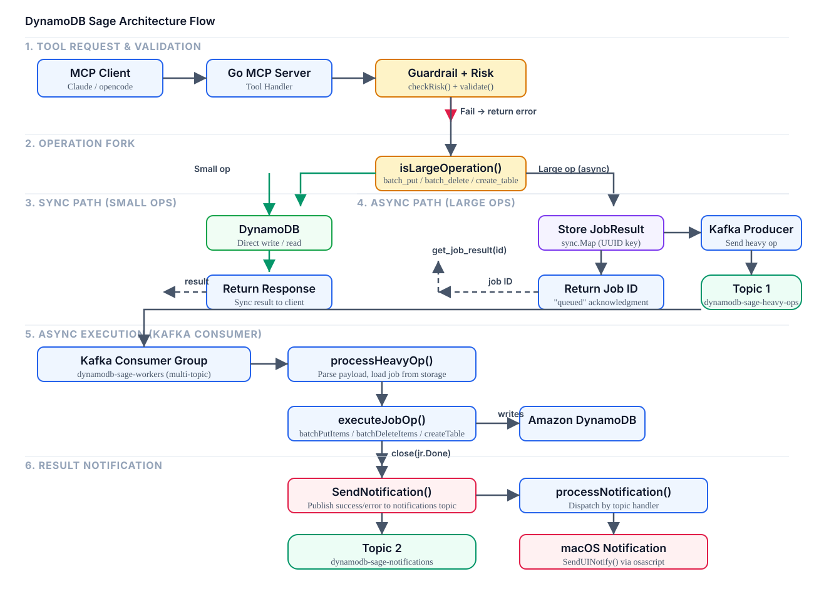

# Architecture

```
MCP Client (Claude / Cursor / opencode)
        │
        ▼
┌──────────────────────────────────────────┐
│           DynamoDB-Sage Server           │
│                                          │
│  ┌──────────┐    ┌──────────────────┐    │
│  │ MCP API  │───▶│  Risk Analyzer   │    │
│  │ POST /   │    │  + Guardrails    │    │
│  └──────────┘    └────────┬─────────┘    │
│                           │              │
│              ┌────────────┴───────────┐  │
│              │                        │  │
│              ▼                        ▼  │
│    ┌──────────────┐    ┌────────────────┐│
│    │  Sync Path   │    │  Async Path    ││
│    │  DynamoDB    │    │  Kafka Worker  ││
│    └──────────────┘    └────────┬───────┘│
│                                 │        │
│                                 ▼        │
│                      ┌──────────────┐    │
│                      │ Notifications│    │
│                      │ SSE → UI     │    │
│                      └──────────────┘    │
│                                          │
│  ┌──────────┐  ┌──────────┐  ┌────────┐ │
│  │ Audit Log│  │ Metrics  │  │ Chat   │ │
│  │ SQLite   │  │Prometheus│  │ Claude │ │
│  └──────────┘  └──────────┘  └────────┘ │
└──────────────────────────────────────────┘
        │
        ▼
   AWS DynamoDB
```

<details>
<summary>Full architecture flow diagram</summary>



*Full description in [../project-flow.md](../project-flow.md)*

</details>

# RAG (Retrieval-Augmented Generation)

DynamoDB-Sage includes a built-in RAG pipeline that turns your DynamoDB tables into a searchable semantic knowledge base. Scan a table, chunk the text, embed it via OpenAI, and store the vectors in Qdrant — then search across all your data with natural language queries.

## How It Works

**Ingestion Flow:**

```
MCP Client calls ingest_document(table, textField)
        │
        ▼
┌──────────────────────────┐
│  1. Ensure Qdrant        │   Create collection (Cosine distance)
│     collection exists    │   if not already present
└──────────┬───────────────┘
           │
           ▼
┌──────────────────────────┐
│  2. DynamoDB Scan        │   Paginated full-table scan
│     (with ExclusiveStart │   extracts primary key + text field
│      Key pagination)     │   from each item
└──────────┬───────────────┘
           │
           ▼
┌──────────────────────────┐
│  3. Chunk                │   Word-level sliding window
│     (500 words, 50       │   with overlap so no semantic
│      word overlap)       │   boundary is lost at edges
└──────────┬───────────────┘
           │
           ▼
┌──────────────────────────┐
│  4. Embed                │   OpenAI text-embedding-3-small
│     (EmbedBatch API)     │   → 1536-dimension vectors
└──────────┬───────────────┘
           │
           ▼
┌──────────────────────────┐
│  5. Upsert to Qdrant     │   Points stored with:
│     (gRPC :6334)         │   • SHA-256 ID (docID + chunkIndex)
│                          │   • float32 vector
│                          │   • payload: {chunk, source, document}
└──────────────────────────┘
```

**Search Flow:**

```
MCP Client calls search_collection(collection, query, limit)
        │
        ▼
┌──────────────────────────┐
│  1. Embed query          │   Single text → 1536-dim vector
│     via OpenAI           │   via text-embedding-3-small
└──────────┬───────────────┘
           │
           ▼
┌──────────────────────────┐
│  2. Qdrant cosine        │   top-K=20 most similar vectors
│     similarity search    │   using cosine distance
└──────────┬───────────────┘
           │
           ▼
┌──────────────────────────┐
│  3. Score threshold      │   Discard results below 0.75
│     filter               │   confidence score
└──────────┬───────────────┘
           │
           ▼
┌──────────────────────────┐
│  4. Return top-K         │   Final 4 results with
│     (finalK=4)           │   chunk text, document ID, score
└──────────────────────────┘
```

## MCP Tools

| Tool | Description |
|------|-------------|
| `ingest_document` | Scan a DynamoDB table, chunk text fields, embed via OpenAI, store in Qdrant |
| `search_collection` | Search a collection by vector similarity with optional filter |

**Example: ingest and search**

```bash
# Ingest the "Users" table, using the "bio" field as the text
ingest_document(tableName="Users", textField="bio")

# Search for similar documents
search_collection(collectionName="Users", query="machine learning experience", limit=5)
```

> RAG tools are only registered if `rag.enabled: true` in `config.yaml` and Qdrant is reachable. If initialization fails, the server runs normally without RAG tools (graceful degradation). See `config.yaml` for embedding model, chunking, and retrieval settings.
