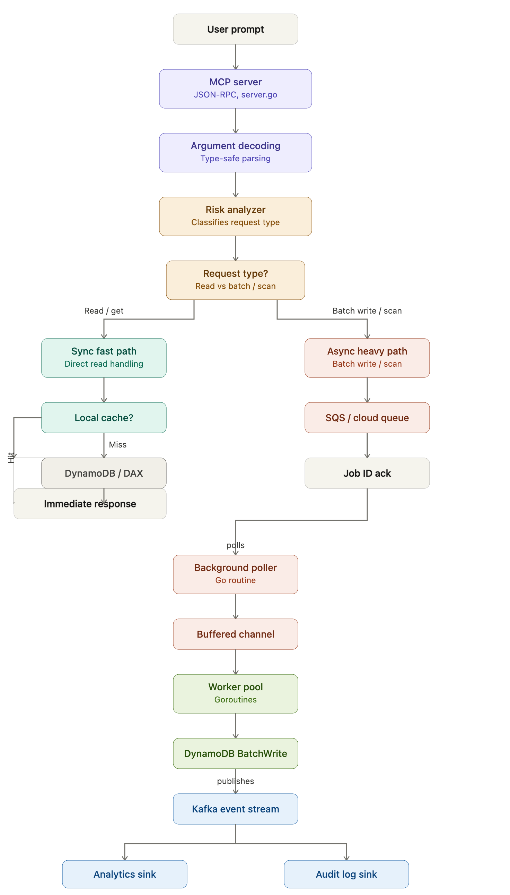

# Project Flow

## DynamoDB Sage MCP Architecture

The architecture flow covers:

1. **Request validation** — incoming tool call is parsed, validated, and the risk analyzer evaluates it
2. **Risk analyzer fork** — operations are classified as safe (proceed) or high-risk (require confirmation)
3. **Synchronous path** — read operations (get_item, query, scan) execute immediately with guardrails
4. **Async batch path** — write operations (batch_put, batch_delete) go through a worker pool with retry logic
5. **Audit & analytics** — all operations are logged to the audit trail and analytics event stream

