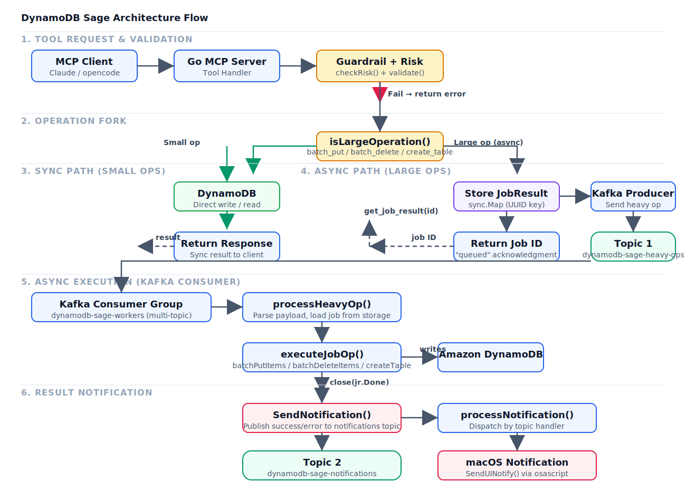

# Project Flow

## DynamoDB Sage MCP Architecture

The architecture flow covers:

1. **Request validation** — incoming tool call is parsed, validated, and the risk analyzer evaluates it
2. **Guardrail checks** — protected tables, tags, schema validation, and cost thresholds
3. **Operation fork** — small operations (get, put, query, scan, delete, update) execute synchronously; large operations (batch_put, batch_delete, create_table) are offloaded to Kafka for async processing
4. **Synchronous path** — DynamoDB call runs immediately, result returned to client
5. **Async batch path** — job is stored in `jobStorage`, published to Kafka topic `dynamodb-sage-heavy-ops`, consumer executes the operation via `executeJobOp`, and publishes a notification to `dynamodb-sage-notifications`
6. **Notifications** — macOS desktop alert displayed on success/failure via `SendUINotify`
7. **Job polling** — client calls `get_job_result` with the job ID to retrieve the result

